**Takahiro Hikida** | Advisor: Dr. Kurt Hoffman 
Summer Research, Department of Physics, Whitman College · June–August 2025

## Abstract

Electronic speckle pattern interferometry (ESPI) was used to image the vibration
patterns of acoustically driven objects of increasing size and complexity: a metal
plate (system characterization), a metal hemisphere, the top plate of a viola, a
snare drumhead, and, as a preliminary test, a piano soundboard. Before imaging, I
characterized the setup by bounding the laser coherence length, calibrating the
reference-mirror piezo, and estimating the piezo drive from the optimum condition
$\gamma T = 2.32$ derived by Moore and Skubal. The hemisphere showed nine
resonances between 64 and 1614 Hz, and five of the six resonances seen in both
mounting orientations agreed within 3 Hz. Where measured resonances could be
matched to a finite-element (COMSOL) model, the four highest agreed within 10%,
while the lowest shell mode differed by 78%. The viola produced visible patterns at
every frequency from about 200 to 1000 Hz, with stronger responses near nine
frequencies, and changing the bridge tension produced no reproducible frequency
shift. The drumhead required drive amplitudes near 0.1 V and showed asymmetric
modes, consistent with non-uniform head tension.

::: {.ja}
電子スペックルパターン干渉法（ESPI）を用いて、音響的に加振した物体の振動パターンを、
サイズと複雑さの順に可視化しました。対象は金属板（装置の特性評価）、金属半球、
ヴィオラの表板、スネアドラムのヘッド、そして予備実験としてピアノの響板です。
撮像の前に、レーザーのコヒーレンス長の下限を見積もり、参照ミラーのピエゾを較正し、
Moore と Skubal が導いた最適条件 $\gamma T = 2.32$ からピエゾの駆動条件を見積もりました。
半球では 64–1614 Hz に 9 つの共振が見られ、2 通りの設置で共通して観測された 6 つのうち 5 つは
3 Hz 以内で一致しました。有限要素（COMSOL）モデルと対応づけられた共振のうち、高次の 4 つは
10% 以内で一致した一方、最低次のシェルモードは 78% ずれていました。
ヴィオラでは約 200–1000 Hz のすべての周波数でパターンが見え、特に 9 つの周波数付近で強く応答しました。
駒の張力を変えても、再現性のある周波数シフトは見られませんでした。
ドラムヘッドは 0.1 V 前後の弱い駆動が必要で、非対称なモードを示しました。これはヘッドの張力が不均一であることと整合します。
:::

## 1. Background and Objectives

In ESPI, light scattered from a rough object surface (object beam) interferes with
a reference beam on a camera sensor, producing a speckle pattern. The setup used
here follows the method of Moore and Skubal [2]: two frames are recorded while the
object vibrates and are subtracted. A reference mirror driven by a piezo at
constant speed adds a linear phase drift between the frames. In the subtracted
image, stationary (nodal) regions appear bright, and vibrating regions appear as
dark contours of equal amplitude, so the mode shape becomes visible.

The objectives of this project were:

- to understand which experimental parameters control image contrast and to set
  them quantitatively;
- to image the resonant modes of objects that differ in stiffness, size, and shape;
- to compare measured hemisphere resonances with a finite-element model and
  identify the limits of the setup.

## 2. Experimental Setup and System Characterization

### 2.1 Optical layout

Imaging used a red laser ($\lambda \approx 633$ nm), and a green laser
($\lambda = 532$ nm) was used only to calibrate the piezo (Section 2.3). The laser
output was split into two paths. The object beam was spread by a ground-glass
diffuser to illuminate the object. The reference beam was reflected by a mirror
mounted on a piezoelectric actuator and spread by a second diffuser before
reaching the camera. A loudspeaker drove the object at a set frequency. Beam
intensities were balanced using the live camera readout in NI MAX, typically by
adjusting the reference beam. The camera aperture was 9.5 mm. On 15 July the
original laser was replaced with a higher-power red laser of the same wavelength,
which was used for the later viola, drumhead, and piano measurements.

### 2.2 Coherence length

Because the hemisphere, viola, and piano produce large differences between object
and reference path lengths, I checked how much path difference the laser
tolerates. Interference fringes remained visible with an object arm of about 1.00 m
and a reference arm of about 3.49 m. The relevant quantity is the path
*difference*, about 2.49 m, so the coherence length of the red imaging laser is at
least about 2.5 m. This is much larger than the path differences in the later
measurements, and fringes were in fact obtained on both the near and far surfaces
of the tilted hemisphere.

### 2.3 Piezo calibration

The piezo displacement per volt was found with the green 532 nm laser by counting
fringe cycles in the interference pattern while changing the voltage. One full
fringe cycle corresponds to a mirror displacement of $\lambda/2 = 266$ nm, because
the reflected path changes by twice the displacement. @tbl-piezo summarizes the
measurements.

| Date | Method | Voltage per fringe cycle |
|------|--------|--------------------------|
| 12 Jun | Automatic voltage ramp; tracked the center of the fringe pattern | 6.43 V |
| 13 Jun | Manual offset steps; tracked positions of fringe lines; mean of several cycles | 4.625 V |
| 16 Jun | Replaced function generator; 4 cycles over a 20 V range; two trials | 4.575 V, 4.60 V |
| 17 Jun | Second (round) piezo; 8 cycles over a 20 V range | 2.29 V |

: Voltage required for one fringe cycle ($\lambda/2 = 266$ nm displacement, green laser). {#tbl-piezo tbl-colwidths="[12,63,25]"}

The 6.43 V value was not reproduced after the function generator was replaced, so
the 16 June value was adopted for the original piezo:
$\alpha = 266\ \text{nm} / 4.575\ \text{V} \approx 58.1$ nm/V. Because $\alpha$ is
a property of the piezo, not of the light, the same value applies when imaging
with the red laser. The main difficulty was slow drift of the fringe pattern,
which I attributed to temperature changes along the beam path.

### 2.4 Choosing the piezo drive

Moore and Skubal [2] show that, for a reference phase that drifts linearly at rate
$\gamma$ during an exposure of length $T$, the brightness of nodal regions is
maximized at $\gamma T = 2.32$, with a broad usable range on either side. For a
mirror moving at speed $v$,

$$
\gamma = 2kv, \qquad k = \frac{2\pi}{\lambda}, \qquad \gamma T = 2.32
$$ {#eq-drift}

The piezo was driven with a triangle wave of peak-to-peak voltage $V_{pp}$ and full
period $T'$. The mirror travels $\alpha V_{pp}$ in each half period, so
$v = 2\alpha V_{pp}/T'$. Substituting into @eq-drift gives

$$
V_{pp} = \frac{2.32\, \lambda T'}{8\pi \alpha T}
$$ {#eq-voltage}

@eq-voltage depends only on the ratio $T'/T$, so fixing the modulation period as a
multiple of the exposure time makes the optimal voltage independent of exposure.
With $\lambda = 633$ nm and $\alpha = 58.1$ nm/V, @eq-voltage predicts
$V_{pp} \approx 4.0$ V for $T' = 4T$ and $V_{pp} \approx 2.0$ V for $T' = 2T$.

Experimentally, the $T' = 2T$ configuration gave the brightest fringes near 4 V,
about twice the prediction, and remained usable for exposure times from 0.0313 to
0.125 s. The $T' = 4T$ configuration gave inconsistent results: its best voltage
changed with exposure time and with which pair of stored frames was subtracted.
All later measurements used $T' = 2T$ with a drive of 4–4.5 V, chosen empirically.
Possible reasons for the factor-of-two difference are discussed in Section 4. (My
original notebook calculation used $v = \alpha V_{pp}/T'$, which omits the factor
of 2 and happened to reproduce the observed 4 V.)

## 3. Results

### 3.1 Metal hemisphere

The hemisphere was first mounted with its flat face up and imaged from the side
(@fig-hemi-vertical). Because this view shows only the near surface, I then tilted
it so that the inner and outer surfaces were both visible. A tilt of about 45°
showed only two modes; a tilt of about 20° reproduced most of the resonances
(@fig-hemi-tilted). Settings were $T' = 2T$, a 4–4.5 V piezo drive, and an
exposure time of 0.125 s.

::: {#fig-hemi-vertical layout-ncol=3}

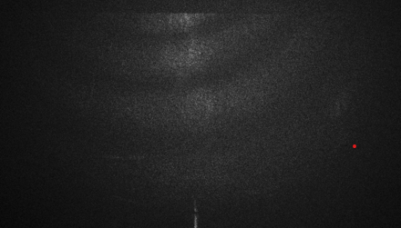

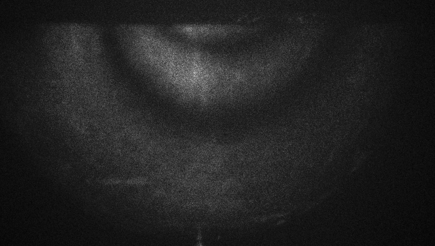

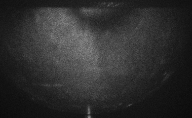

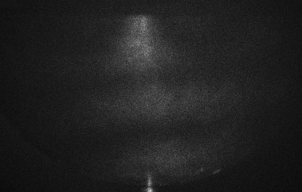

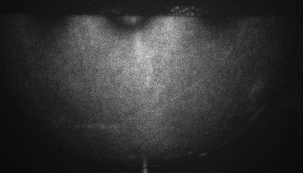

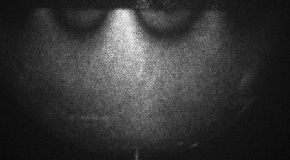

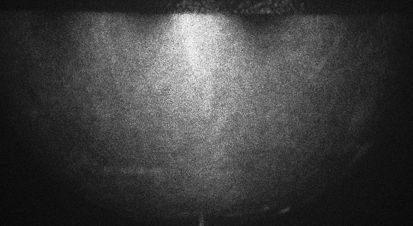

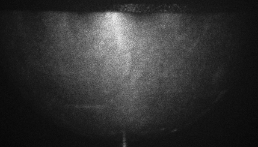

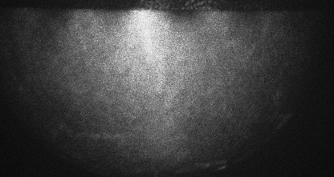

Hemisphere resonances, vertical mounting.
:::

::: {#fig-hemi-tilted layout-ncol=3}

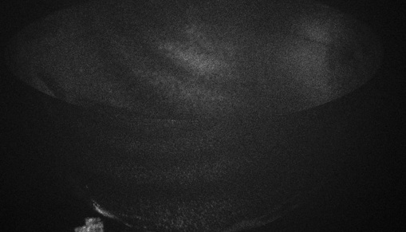

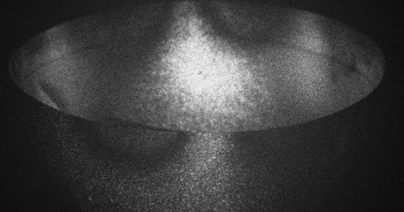

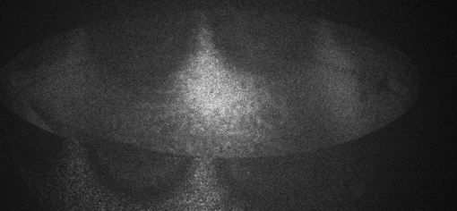

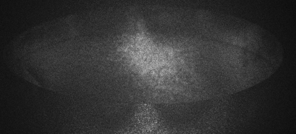

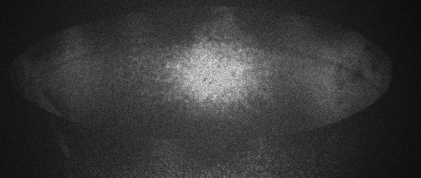

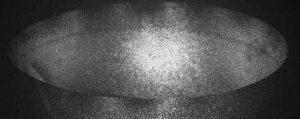

Hemisphere resonances, tilted about 20° so that both surfaces are visible.
:::

On 7 July I measured the frequency range over which each pattern stayed visible.
The ranges were 1.7 to 13.4 Hz wide, so the measured frequencies should be read as
accurate to a few hertz, not to 0.1 Hz. Ranges wider than 10 Hz may contain two
overlapping modes; for example, the 730.3 and 737.5 Hz patterns may be one mode or
a pair split by small asymmetries of the shell.

**Comparison with a finite-element model.** Ellie St. Pierre built a COMSOL
eigenfrequency model of the hemisphere (selected mode shapes in @fig-model).
@tbl-hemi lists the model frequencies alongside the measurements, matched by mode
shape as in our model-versus-image comparison document.

::: {#fig-model layout-ncol=3}

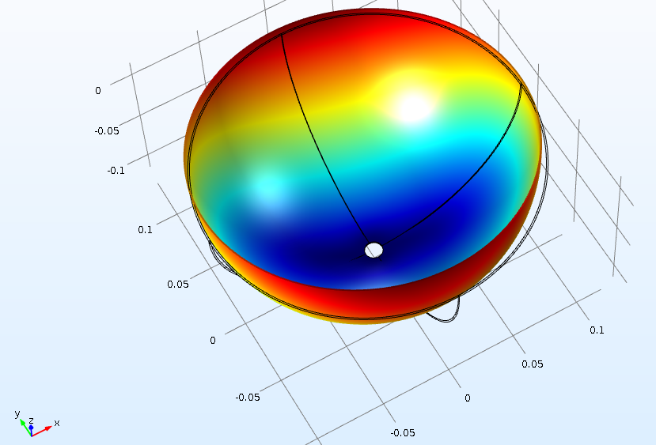

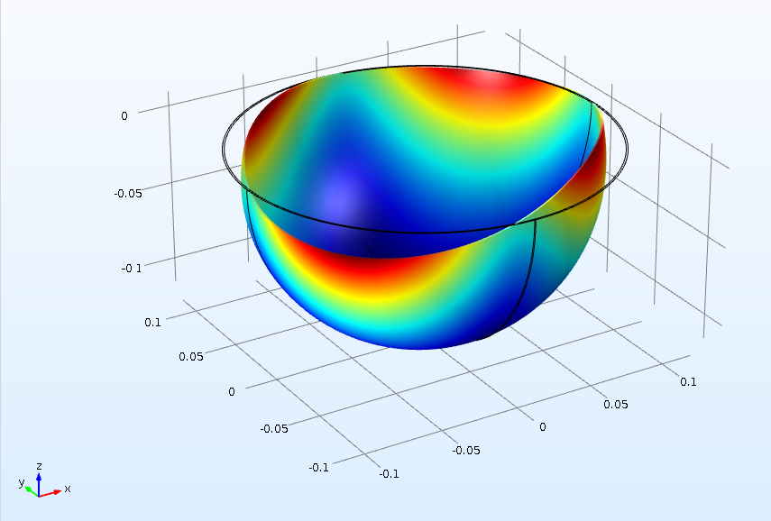

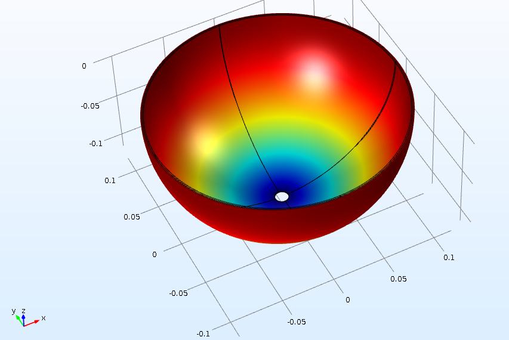

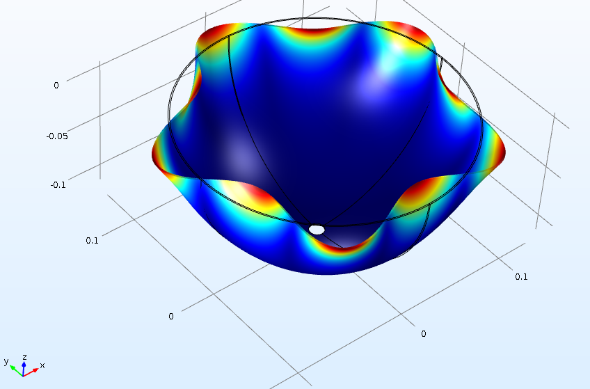

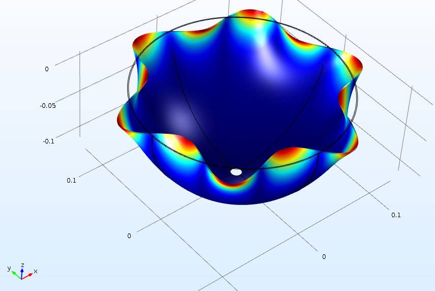

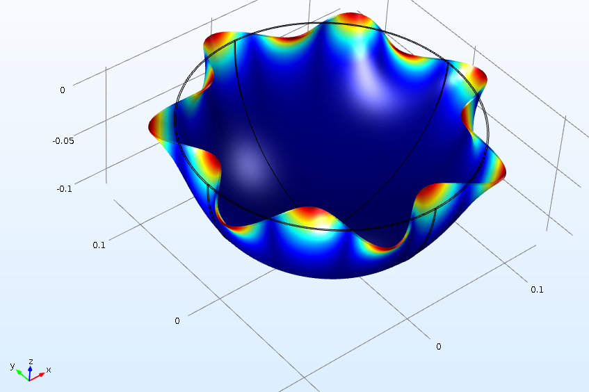

COMSOL eigenmodes of the hemisphere (model by Ellie St. Pierre). Color shows total displacement.
:::

| Model (Hz) | Vertical (Hz) | Tilted ~20° (Hz) | Diff. | Note |
|------------|---------------|------------------|-------|------|
| 60.67 / 60.71 | 64.0 | 63.5 | +5.5% | Near-degenerate pair |
| 95.7 | 170.6 | — | +78% | Paired by shape; largest mismatch |
| 235.5 | — | — | | Not identified |
| — | 321.6 | 311.4 | | No model mode assigned |
| 409.5 | — | — | | Whole bowl moving axially; not observed |
| 445.6 | 504.5 | 507.6 | +13.2% | |
| 695.8 | — | — | | Motion only at attachment; not expected to be visible |
| 709.3 | 730.3 (737.5) | 730.2 | +3.0% | |
| 1021.4 | 990.2 | 989.9 | −3.1% | |
| 1378.0 | 1300.5 | 1299.5 | −5.6% | |
| 1775.2 | 1614.5 | — | −9.1% | |
| 2210.9 | — | — | | Not observed |

: Measured resonances and COMSOL eigenfrequencies. Diff. = (vertical − model) / model. {#tbl-hemi}

Above 700 Hz the model and measurement agree within 10%. Across all matched shell
modes, however, the difference decreases steadily with frequency, from +78% to
+13.2%, +3.0%, −3.1%, −5.6%, and −9.1%. A single error in a material constant
would shift all frequencies by the same ratio, so this systematic trend suggests a
difference in geometry or mounting between the model and the real hemisphere, with
the low-order modes most sensitive to how the hemisphere is attached. This
interpretation has not been tested. The 321.6 Hz resonance has no assigned model
counterpart. The axial mode at 409.5 Hz, which the model predicts could be seen in
a tilted geometry, was not observed. The full side-by-side comparison is available
[here](https://docs.google.com/document/d/1FwbeYv0UMGcwDgmw2n5k4-XLW7mxpoIujZBjByzLFFA/edit?tab=t.0).

### 3.2 Viola

The viola is much larger than the hemisphere, which caused two problems. First,
the diffused reference beam was brightest at its center, so only the middle of the
body showed fringes. Moving the reference diffuser farther from the camera spread
the beam more evenly. Second, with the wider field the object beam became too weak
relative to the reference beam; moving the viola and the piezo mirror back
rebalanced the intensities while keeping the beams coherent.

Unlike the hemisphere, the viola showed a pattern at every drive frequency,
starting at about 200 Hz. I scanned 200–1000 Hz in 10 Hz steps and then rescanned
around frequencies with a strong response. Frequencies with a clearly strong
response were near 220, 260, 360, 390, 440, 570, 650, 685, and 800 Hz, each
uncertain by about ±5 Hz because of the 10 Hz step. After the laser upgrade,
averaging several frames clearly improved contrast (@fig-viola). The measured
frequencies mostly matched an unpublished dataset recorded in the lab on the same
instrument in 2024, with a few frequencies found in only one of the two datasets.

::: {#fig-viola layout-ncol=3}

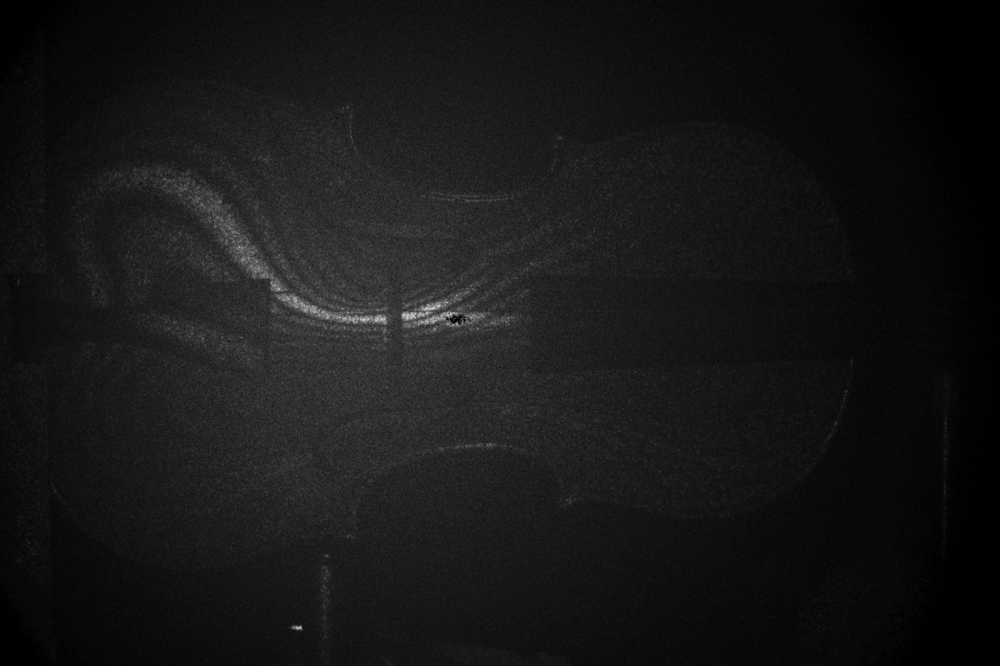

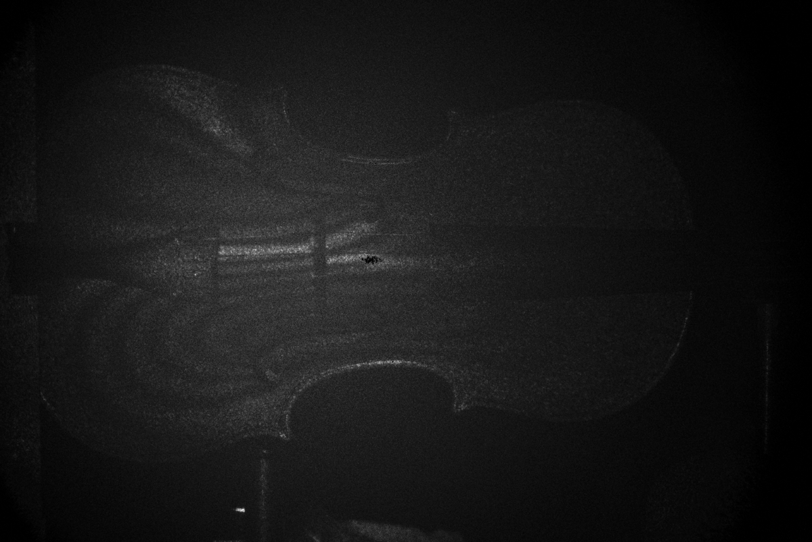

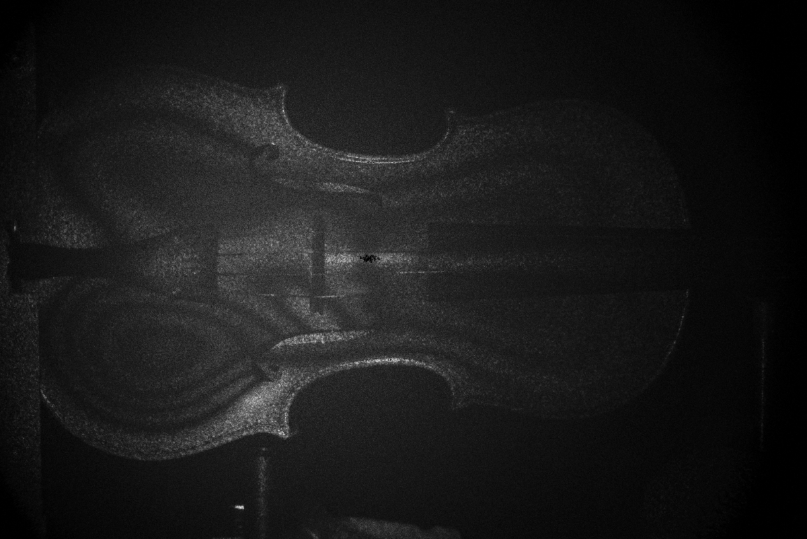

Viola top plate at three drive frequencies (higher-power laser, frame averaging). 440 Hz is one of the strong resonances listed in the text; 210 and 670 Hz show the pattern at frequencies between them.
:::

**Effect of bridge tension.** After changing the tension on the bridge, a first
scan suggested a small decrease in the mode frequencies, but a full repeat scan
showed no shift for any observable mode. Bridge tension therefore had no effect
detectable at this frequency resolution, consistent with the earlier measurement
in the lab.

### 3.3 Drumhead

The snare drum was held between two optical posts, with a cushion to reduce
vibration transmitted from the table (@fig-drum-tension, left). This clamps the
shell from the side and may slightly alter the boundary condition, but it was
stable enough to image.

At first only the nodal outline near the rim was visible and the center was dark.
The cause was overdriving: the membrane is much less stiff than the other objects,
so at the original speaker level its amplitude was large enough that the fringes
near the center were too dense to resolve. Lowering the speaker drive to about
0.1 V or less made the patterns visible. Too little drive, however, let the
fundamental-mode pattern (60 Hz), which appeared at every drive frequency, dominate
the image, so the drive had to be balanced between the two. In one session the
patterns were clearer with the piezo switched off, possibly because this
suppressed the fundamental-mode background.

Seven modes were found in total; six are shown in @fig-drum. None was axially
symmetric, and the patterns became more complex at higher frequency. The asymmetry
is consistent with non-uniform tension across the head (an interpretation, not
tested directly).

::: {#fig-drum layout-ncol=3}

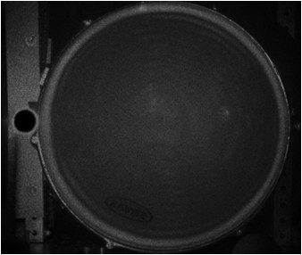

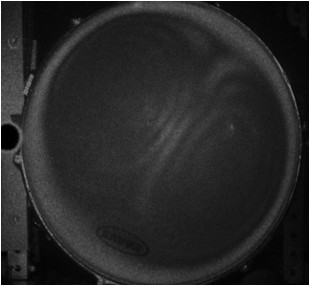

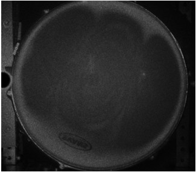

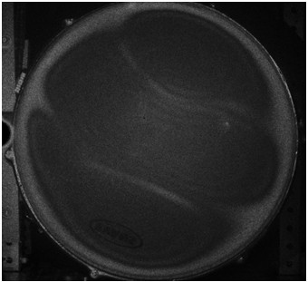

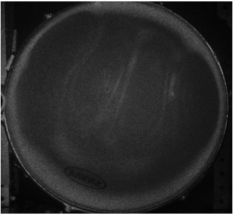

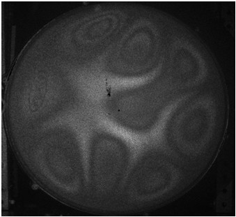

Drumhead modes.
:::

**Effect of tension.** Loosening the two upper tension screws shifted the center of
the fundamental-mode pattern toward the loosened screws (@fig-drum-tension, right),
showing directly that uneven tension breaks the symmetry of the mode.

::: {#fig-drum-tension layout-ncol=2}

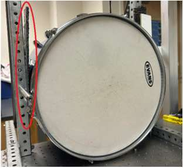

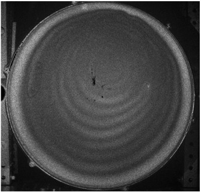

Drum mounting and the tension test.
:::

All drumhead images:
[image folder](https://drive.google.com/drive/folders/1X4MxfZjFVEiNugM8Fy3t4Fd4ph9sKtA5).
Viola images:
[image folder](https://drive.google.com/drive/folders/1fSnSLAet4q3R7I2JZGuUH-cxnDZsEqQi).

### 3.4 Piano soundboard (preliminary)

In the final two weeks, Ethan Hawkins and I moved the laser and camera onto a
portable ESPI system and transported it to the music building. Specular reflection
from the center of the soundboard saturated the camera and darkened the rest of the
image; tilting the piano moved the reflection out of the field of view. Scanning
100–320 Hz with a 0.625 s exposure and five-frame averaging produced visible
patterns at several frequencies. A repeat measurement on 4 August gave darker
images that could not be corrected by rebalancing the beams, so the piano results
remain preliminary.

## 4. Discussion

Four practical points determined image quality across all objects:

- **Beam balance.** Contrast was best with matched beam intensities. On the viola
  I initially assumed the object beam was the stronger one; measuring showed the
  opposite, so the weaker beam should be identified by measurement, not by
  assumption.
- **Drive amplitude vs. stiffness.** Stiff objects (plate, hemisphere) needed
  strong drive, while the drumhead needed roughly 0.1 V. Overdriving hides the
  mode rather than enhancing it.
- **Phase modulation.** Fixing $T'$ as a multiple of the exposure time made the
  optimal piezo voltage independent of exposure (@eq-voltage).
- **Averaging.** Averaging frames greatly improved contrast, but only when the
  pattern was stable between frames.

**Open question: the piezo drive.** The best observed drive was about twice the
value predicted by @eq-voltage. Three explanations seem plausible but have not been
tested. First, the theory assumes the two subtracted frames are recorded back to
back; if the frames are separated by a delay $T_0$, the phase step between them
becomes $\gamma T_0$ (Eq. 21 of [2]). The software subtracted frames stored in
buffers 0 and 3 rather than adjacent frames, and the optimum voltage did change
when other buffer pairs were used. Second, with $T'$ only two to four times the
exposure, the triangle wave reverses direction during or between exposures, so the
mirror speed is not constant as the theory assumes. Third, the calibration was
quasi-static, while the piezo was driven at several hertz during imaging. A direct
test would be to measure nodal-region brightness versus $V_{pp}$ for adjacent-frame
subtraction and compare it with Fig. 5 of [2].

Other limitations are that all results are qualitative images, that frequencies
were identified by eye with an uncertainty set by the resonance width or scan step
(a few hertz), and that one hemisphere resonance (321.6 Hz) is not yet matched to
the model.

## 5. Future Work

- Measure nodal brightness versus piezo voltage with adjacent-frame subtraction to
  resolve the factor-of-two discrepancy in Section 2.4.
- Quantitative fringe analysis: extract the fringe order in small image regions to
  estimate vibration amplitude.
- Assign the 321.6 Hz hemisphere resonance by counting nodal lines, and refine the
  model geometry and mount to explain the frequency-dependent mismatch.
- Tension the drumhead uniformly with a tension gauge, test whether symmetric
  modes appear, and then vary tension in controlled steps.
- Complete narrow-band scans of the piano soundboard around the resonances found
  in the broad scan.

## Acknowledgments

I thank Dr. Kurt Hoffman for supervision and guidance, Ellie St. Pierre for the
COMSOL model of the hemisphere, and Ethan Hawkins for collaboration on the
measurements.

## References

1. M. C. Horne, "Measuring Resonances of Guitar Top Plates at Various Stages of
   Fabrication," senior thesis, Whitman College (2022).
2. T. R. Moore and J. J. Skubal, "Time-averaged electronic speckle pattern
   interferometry in the presence of ambient motion. Part I. Theory and
   experiments," *Applied Optics* 47(25), 4640–4648 (2008).
   [doi:10.1364/AO.47.004640](https://doi.org/10.1364/AO.47.004640)
